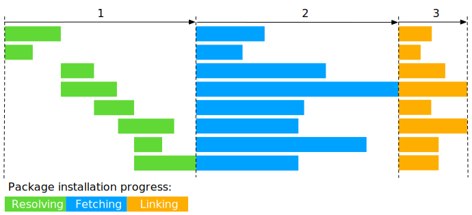

## Motivation
### Saving disk space

In the official explanation, pnpm can save disk space by storing all files in a single place and giving all packages a hard link from that location. If your different projects depend on different versions of the same dependency, only the files that differ are added to the store.

> Does pnpm use hard-link for all of its packages? For more details, please visit [this page](https://pnpm.io/npmrc#package-import-method).

TODO: How does pnpm use symlinks?

### Boosting installation speed

In traditional installers, the three-stage installation process(resolving, fetching, and writing all dependencies to `node_modules`) is executed step by step.

Unlike traditional installers, pnpm uses a new installation process that consists of three stages.
1. 